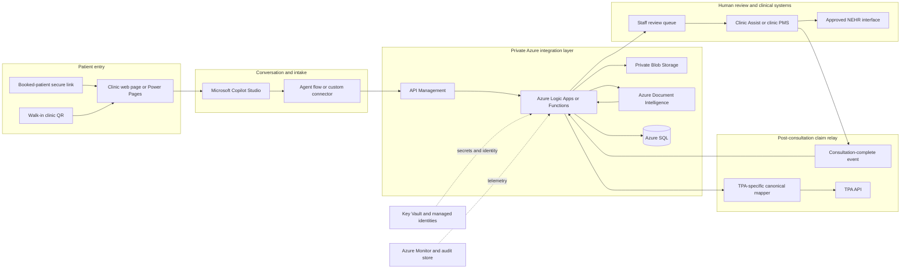

# Unified Asynchronous Intake and TPA Auto-Relay

A mock patient-facing demonstration and technically feasible Microsoft implementation proposal for shifting clinic intake out of the front-desk queue and automating Third-Party Administrator (TPA) claim relay.

> [!IMPORTANT]
> The Streamlit application in this repository is a fake-data UI demo, not the production architecture. It does not currently connect to Microsoft Copilot Studio, Azure Document Intelligence, Azure SQL, Power Automate, Azure Logic Apps, Clinic Assist, NEHR, or a TPA portal. Do not enter real patient or medical data. The target architecture and controls described below require security, privacy, legal, clinical, and integration review before deployment.

## Team Information

| Field | Details |
| --- | --- |
| Team | The Mews |
| Institution | Nanyang Technological University (NTU) |
| Team size | 1 |
| Contact person | Robert Lim Zhi Hao |

## Executive Summary

Clinic staff can spend an estimated 23 to 32 minutes per patient on registration, medical-chit interpretation, billing, and duplicate TPA portal entry. At an illustrative midpoint of 27 minutes across 40 patients, that is 1,080 minutes, or 18 staff-hours, of administrative effort.

The proposed Unified Asynchronous Intake and TPA Auto-Relay moves suitable work before arrival or into otherwise passive waiting time:

- Booked patients receive a short-lived secure registration link after booking.
- Walk-in patients scan a clinic QR code and complete the same flow on their own phone.
- Microsoft Copilot Studio guides the conversation and consent journey.
- Azure Document Intelligence extracts structured fields from medical chits and authorization letters.
- Staff retain the mandatory in-person NRIC/FIN identity and e-card verification step.
- After consultation, an API-first relay sends medication and screening data to the appropriate TPA workflow.

The intended outcome is to reduce queues, remove duplicate typing, lower transcription errors, and return staff time to patient care. The time and throughput figures in this proposal are hypotheses to validate in a measured clinic pilot, not results produced by this demo.

## Problem Understanding

### Current Workflow

1. Patients arrive and wait at registration.
2. Staff inspect identity and e-card documents.
3. Staff locate or create the patient record.
4. Staff manually type registration details.
5. Staff interpret medical chits with inconsistent employer and insurer formats.
6. Staff determine benefits and coverage.
7. Staff repeat the same data entry in one or more TPA portals.
8. After consultation, staff enter medication, screening, and claim details.

### Root Causes

- Employers and insurers use non-standard forms and benefit structures.
- Important data arrives as physical or unstructured documents.
- Clinic and TPA systems are not consistently integrated.
- Identity checks, document interpretation, and data entry are concentrated at the front desk.
- Legacy portal workflows reward manual copying instead of reusable structured data.

### Why It Matters

- Registration delays access to care for every patient behind the bottleneck.
- Duplicate entry consumes skilled staff time and introduces typing errors.
- Slow claims and incorrect benefit interpretation can increase rejections and rework.
- Administrative load leaves less time for preventive-care conversations, including adult vaccination uptake.

## Proposed AI Solution

The production concept separates conversational guidance, document extraction, workflow orchestration, and system integration rather than asking one model to perform every task.

- **Microsoft Copilot Studio:** Patient conversation, topic routing, validation prompts, consent status, action invocation, and human handoff.
- **Azure Document Intelligence:** Schema-bound extraction of identity fields, employer codes, authorization details, limits, and benefit structures from uploaded documents.
- **Azure Logic Apps or Copilot Studio agent flows:** Orchestration, retries, status transitions, notifications, and calls to approved downstream APIs.
- **Azure SQL Database:** Temporary structured intake and workflow state keyed by an opaque intake ID.
- **Azure Blob Storage:** Private, short-retention storage for source documents while extraction and review are in progress.
- **API Management and Azure Functions:** A stable, authenticated facade over clinic, NEHR, and TPA-specific integrations.
- **Azure OpenAI, where justified:** Intent support or constrained explanation through an approved action. It must not invent, infer, or overwrite clinical or benefit fields.

The system remains human-supervised. Staff perform the required in-person identity and e-card check, review low-confidence or conflicting fields, and initially approve outbound TPA claims before submission.

## What This Repository Demonstrates

The Streamlit demo represents only the patient-facing happy path:

- Opening a hospital registration page
- Starting a chat-style intake
- Entering a patient name
- Uploading a medical chit or authorization letter
- Reading paragraphs and tables from a DOCX file locally
- Generating and copying a mock six-digit reference code

It deliberately uses fake branding, a placeholder phone number, in-memory session state, and a random reference code. The production mapping later in this README explains what replaces each mock component.

## Patient Experience

The current flow mirrors a pre-arrival registration conversation:

1. The patient opens the hospital webpage and selects **Register Now**.
2. The registration assistant greets the patient.
3. The patient enters the trigger phrase `I need to register`.
4. The assistant asks for the patient's full name.
5. The patient uploads a medical chit or authorization letter.
6. The application processes the upload and generates a six-digit reference code.
7. The patient copies the code to their clipboard and shows it at the front desk upon arrival.

The interface is designed around older and less technical users, with large controls, high-contrast colors, short instructions, visible progress, and one primary task per screen.

## Current Features

- Responsive Streamlit interface for desktop and mobile browsers
- Hospital-style landing page and guided registration assistant
- Exact trigger-phrase validation before starting intake
- Patient-name validation and safe HTML escaping
- Upload support for Word documents, PDFs, and common image formats
- Text extraction from DOCX paragraphs and tables
- Clear feedback for damaged or textless Word documents
- Six-digit reference-code generation using Python's `secrets` module
- In-page clipboard action with a browser compatibility fallback
- Session reset for starting another registration
- No local database or permanent patient-record storage

## Supported Documents

| Format | Accepted | Text currently extracted | Notes |
| --- | --- | --- | --- |
| `.docx` | Yes | Yes | Reads non-empty paragraphs and table cells with `python-docx`. |
| `.pdf` | Yes | No | Accepted by the interface, but PDF text extraction is not implemented. |
| `.png` | Yes | No | Accepted by the interface, but OCR is not implemented. |
| `.jpg` / `.jpeg` | Yes | No | Accepted by the interface, but OCR is not implemented. |
| `.doc` | No | No | Legacy Word files must first be converted to `.docx`. |

For DOCX uploads, extracted text is available in a collapsed review section on the completion screen. PDF and image uploads continue through the prototype flow without reading their contents.

## Demo-to-Production Mapping

| Streamlit mock | Production Microsoft implementation | Required work |
| --- | --- | --- |
| Hospital landing page | Clinic website, patient portal, or Power Pages page with an embedded Copilot Studio web channel | Clinic branding, accessibility review, consent notice, analytics, and approved hosting |
| `Register Now` button | Booked-patient one-time link or walk-in QR code | Booking-system event, Logic App, SMS/email provider, expiring token, and QR campaign management |
| Hard-coded trigger phrase | Copilot Studio topic trigger, intent routing, or generative orchestration with an explicit intake topic | Topic design, fallback handling, language variants, and conversation testing |
| Name text box | Copilot Studio question node and typed variable | Input validation and later reconciliation against the clinic record; this is not identity proof |
| Streamlit file uploader | Private upload endpoint invoked from the patient web experience, or channel attachment support after channel-specific validation | MIME/content checks, malware scanning, size limits, private Blob Storage, and short retention |
| Local `python-docx` parser | Azure Document Intelligence classifier plus custom extraction models | Labeled training documents, field schema, confidence thresholds, evaluation set, and model versioning |
| `st.session_state` | Azure SQL or Dataverse workflow record keyed by an opaque `intakeId` | Data model, encryption, retention, concurrency, recovery, and least-privilege access |
| Random six-digit code | API-issued unique, expiring, collision-checked reference tied to the intake record | Transactional generation, status lookup, expiry, rate limiting, and audit events |
| Clipboard button | Copilot response or Adaptive Card displaying the backend-issued reference code | Channel rendering tests and accessible fallback text |
| No staff screen | Clinic Assist work queue or a small staff review app | Low-confidence review, identity/e-card verification, correction history, and role-based access |
| No post-consultation path | Clinic-system event to Logic Apps, then an API-first TPA relay | Vendor API contracts, mapping, idempotency, retries, reconciliation, and human approval |

## Target Microsoft Architecture



### Why These Boundaries Are Feasible

- Copilot Studio owns conversation topics, prompts, variables, validation, and action invocation; it does not become the clinical database.
- An agent flow can handle short synchronous operations. Longer Document Intelligence jobs should return a job ID and use status polling or an asynchronous notification pattern rather than holding a conversation action open indefinitely.
- API Management provides one stable contract to Copilot Studio while clinic and TPA adapters evolve independently.
- Logic Apps provides durable orchestration, retry policies, connector support, and operational visibility. Azure Functions can handle validation or transformation that is awkward in a low-code flow.
- Source files belong in a private Blob container, not in Azure SQL or a conversation transcript. Azure SQL stores the structured result, status, confidence, and references to controlled objects.
- Document Intelligence extracts against a defined schema and returns confidence information. It does not decide coverage or invent missing medical values.
- The post-consultation relay is system-to-system. It should be triggered by a trusted clinic event, not by a patient conversation message.

## Microsoft Copilot Studio Implementation

### 1. Patient Entry Channels

**Booked patients:** A booking-created event calls a Logic App that creates an intake record and sends an SMS or email through an approved provider. The URL contains a single-use opaque token with a short expiry, not an NRIC/FIN or medical information. The clinic webpage validates and exchanges the token server-side before loading the appropriate intake state.

**Walk-in patients:** A static QR code identifies the clinic location and opens a fresh intake flow. It must not encode patient data. The resulting record remains unverified until front-desk staff complete the mandatory identity and e-card check.

Copilot Studio can be published to a website channel. For external patients who do not have organizational Microsoft Entra accounts, the implementation must choose one of the following during design:

- Authenticate through an existing patient portal.
- Use Microsoft Entra External ID for patient accounts.
- Use a narrowly scoped, one-time intake token validated by the clinic backend while treating the conversation as unverified.

The one-time token should not be logged as free-text conversation content.

### 2. Agent Topics

| Topic | Purpose | Exit condition |
| --- | --- | --- |
| Welcome and route | Explain the service, detect intake intent, offer language/help options | Patient selects pre-arrival registration |
| Resolve intake | Validate the booking token or create a walk-in intake | Backend returns an opaque `intakeId` |
| Capture details | Ask only for minimum required demographic/contact fields | Required fields pass format validation |
| Capture consent | Present versioned General or Occupational Health consent | Consent event is recorded with version and timestamp |
| Collect document | Launch the approved upload control and receive a `documentId` | Upload service confirms scan and storage |
| Process document | Start extraction and report progress | Structured result is ready or routed to review |
| Review and confirm | Show patient-safe fields for confirmation without exposing internal benefit logic | Corrections are recorded or staff review is requested |
| Complete intake | Request a reference code and provide arrival instructions | Backend returns an expiring reference code |
| Help and handoff | Handle confusion, accessibility needs, or failures | Staff callback/help path is created |

For consent that requires a legally binding signature rather than an acknowledgement, use an approved e-signature service or secure Power Pages form. A conversational `Yes` alone should not be assumed to satisfy legal signature requirements.

### 3. Agent Actions and Contracts

Copilot Studio should call well-defined actions rather than connect directly to every system. A practical action surface is:

| Action | Input | Output |
| --- | --- | --- |
| `CreateIntakeSession` | Booking token or clinic location | `intakeId`, status, expiry |
| `SaveIntakeDetails` | `intakeId`, validated patient fields | Updated status and missing fields |
| `RecordConsent` | `intakeId`, consent type/version, answer, timestamp | Consent receipt ID |
| `CreateDocumentUpload` | `intakeId`, filename, MIME type | Short-lived upload URL and `documentId` |
| `StartDocumentExtraction` | `intakeId`, `documentId` | Extraction job ID |
| `GetExtractionStatus` | Job ID | Status, schema fields, confidence, review flags |
| `CompleteIntake` | `intakeId` | Unique reference code and arrival instructions |
| `GetIntakeStatus` | Reference code | Safe status summary for staff lookup |
| `SubmitTpaClaim` | Approved consultation/claim ID | TPA receipt, status, or actionable error |

Each mutating action should accept an idempotency key. Retries must return the original result rather than create duplicate sessions, uploads, or claims.

### 4. Secure Document Intake

Copilot Studio attachment behavior varies by channel and platform limits. The production-safe baseline is therefore:

1. The agent calls `CreateDocumentUpload`.
2. The backend returns a short-lived, single-object upload URL or opens an embedded approved upload page.
3. The browser uploads directly to a private quarantine container.
4. The service validates extension, MIME type, magic bytes, size, and malware-scan result.
5. A Logic App sends the approved document to Document Intelligence.
6. The source is deleted after the configured extraction/review retention period, with deletion recorded in the audit trail.
7. The agent receives only `documentId`, status, and patient-safe confirmation text.

If native file attachments are used in the selected Copilot Studio web channel, the team must validate supported file types, size limits, data location, transcript behavior, and DLP policy in the target tenant. The architecture should retain the upload-service fallback so channel limitations do not block deployment.

### 5. Azure Document Intelligence Design

- Use a custom classifier to distinguish medical chits, authorization letters, consent forms, and unsupported files.
- Route each supported class to a versioned custom extraction model.
- Define fields such as patient name, employer code, insurer/TPA, authorization number, validity dates, benefit categories, and coverage limits.
- Keep extracted value, normalized value, confidence, page/bounding region, source model version, and review status.
- Send missing required fields, conflicting values, expired authorizations, and values below the agreed confidence threshold to staff review.
- Never ask the LLM to guess unreadable values or infer coverage that is absent from the source.

### 6. Clinic, NEHR, and TPA Integration

Clinic Assist and NEHR integration is feasible only through interfaces approved by the system owner and healthcare institution. The proposal does not assume that either exposes an unrestricted public API.

Use a canonical internal schema so each external adapter maps to one stable model. API integrations are preferred because they can support validation, idempotency, and deterministic error handling. Where a TPA has no supported API, a separately governed Power Automate Desktop/RPA adapter may be considered as a temporary exception, with UI-change monitoring and a manual fallback queue.

After consultation, a trusted clinic-system event starts the claim relay. The workflow reads finalized medication and screening data, maps TPA-specific codes, validates required fields, and submits the claim. Initial rollout should require staff approval before submission; straight-through processing can be enabled later only for low-risk cases with proven accuracy.

## Project Structure

```text
.
├── app.py            # Streamlit UI, registration flow, DOCX parser, and clipboard control
├── requirements.txt  # Python runtime dependencies
├── LICENSE           # MIT License
└── README.md          # Project documentation
```

## Requirements

- Python 3.10 or newer
- `pip`
- A modern browser with JavaScript enabled

The project is currently tested with Python 3.12. Runtime packages are declared in `requirements.txt`:

- `streamlit`
- `python-docx`

## Local Setup

Clone the repository:

```bash
git clone https://github.com/Nightingaling/The-Unified-Asynchronous-Intake-TPA-Auto-Relay.git
cd The-Unified-Asynchronous-Intake-TPA-Auto-Relay
```

Create and activate a virtual environment:

```bash
python3 -m venv .venv
source .venv/bin/activate
```

On Windows PowerShell, activate it with:

```powershell
.venv\Scripts\Activate.ps1
```

Install dependencies:

```bash
python -m pip install -r requirements.txt
```

Start the application:

```bash
streamlit run app.py
```

Streamlit normally serves the app at `http://localhost:8501`. If that port is already occupied, choose another one:

```bash
streamlit run app.py --server.port 8502
```

## Using the Application

1. Open the URL printed by Streamlit.
2. Select **Register Now**.
3. Enter `I need to register` and select **Send Message**.
4. Enter the patient's full name and select **Send Name**.
5. Drag a file into the upload area or use the file chooser.
6. Select **Process Document**.
7. For a DOCX file, optionally review the extracted text.
8. Select **Copy Reference Code**.
9. Use **Start a New Registration** to clear the current session and restart.

## Implementation Details

### Registration State

The application uses a small state machine stored in `st.session_state`:

| Step | Screen |
| --- | --- |
| `0` | Hospital landing page |
| `1` | Registration assistant and trigger phrase |
| `2` | Patient name |
| `3` | Document upload and processing |
| `4` | Completion and reference code |

Additional session values hold the patient name, uploaded filename, extracted DOCX text, and generated reference code. These values are cleared when a new registration starts.

### DOCX Extraction

`read_docx_text()` receives Streamlit's uploaded file object and:

1. Rewinds the file stream.
2. Opens the document with `python-docx`.
3. Collects non-empty paragraph text.
4. Collects non-empty table cells, joining cells from the same row with `|`.
5. Returns the extracted content as newline-separated text.

Unreadable DOCX files show an error instead of completing registration. Valid DOCX files with no readable text show a warning and remain on the upload step.

### Reference Codes

Reference codes are generated with:

```python
str(100000 + secrets.randbelow(900000))
```

This always produces a six-digit value. The prototype does not store issued codes or check for collisions, so these codes must not be treated as durable registration identifiers in production.

### Clipboard Behavior

The completion screen uses a browser-side clipboard button rather than downloading a text file. It first attempts the modern Clipboard API and falls back to a temporary hidden text area for older browsers.

Clipboard access works most reliably on `localhost` or a site served over HTTPS. If browser policy blocks clipboard access, the reference code remains visible for manual entry.

## Branding and Configuration

The displayed organization name and help number are placeholders:

- Organization: `Medical Centre`
- Help number: `(555) 010-2020`

Update these values in `app.py` before presenting or deploying the application. The visual theme is also defined in the CSS block near the top of that file through variables such as `--navy`, `--blue`, and `--green`.

For a production implementation, move organization details and environment-specific settings into configuration or environment variables rather than hard-coding them.

## Accessibility

The interface currently includes:

- Large buttons and form controls
- High-contrast text and action colors
- Clear progress labels
- Plain-language prompts
- Focus styling on the clipboard control
- An `aria-live` status message after copying
- Responsive layouts for narrow mobile screens

A production release should still undergo keyboard-only testing, screen-reader testing, color-contrast verification, zoom testing, and a formal WCAG 2.2 review.

## Operational Impact and Pilot Measurement

The proposal targets work currently concentrated at the front desk and during TPA claim submission. The headline scenario is:

$$
40\ \text{patients} \times 27\ \text{minutes per patient} = 1{,}080\ \text{minutes} = 18\ \text{staff-hours}
$$

The 27-minute midpoint sits within the stated 23-to-32-minute administrative range. This is an illustrative workload calculation, not a claim that all 18 hours will be removed. Mandatory identity checks, exceptions, clinical review, and non-TPA work remain.

| Outcome | Baseline hypothesis | Pilot measure | Initial success criterion |
| --- | --- | --- | --- |
| Front-desk registration | Up to 8 minutes per patient | Median arrival-to-registration-complete time | Material reduction while preserving the 1-minute staff verification |
| TPA administration | Up to 25 minutes of manual work per TPA patient | Staff touch time from consultation close to accepted submission | At least 50% reduction in pilot, with a path toward higher automation |
| Queueing | Physical registration or kiosk queue | Median and 90th-percentile queue time | Reduced without excluding patients who need staff help |
| Data quality | Duplicate typing and interpretation errors | Corrections per 100 intakes and rejected claims | No increase in safety events; fewer preventable corrections |
| Extraction quality | Manual reading | Field-level precision/recall and low-confidence rate by document type | Threshold agreed with operations before any straight-through processing |
| Patient completion | Unknown | Link-open, consent, upload, and completion funnel | Establish baseline by age/language/accessibility segment |
| Preventive-care capacity | Staff time constrained by administration | Vaccination conversations/offers completed per eligible patient | Determine whether recovered staff time improves preventive-care activity |
| Claim/revenue outcome | Avoidable rejections and delayed submissions | First-pass acceptance, rejection reason, and time to accepted claim | Fewer preventable rejections without inappropriate claims |
| Reliability | Manual fallback | Successful workflow percentage, retry rate, and mean recovery time | No lost intake or duplicate TPA claim |

Any reported time saving should separate total elapsed time from staff touch time and state what proportion of patients are TPA patients. A controlled pilot should compare equivalent clinic sessions and retain a manual fallback.

## Feasibility and Delivery Plan

### Required Resources

- Microsoft Copilot Studio licenses and a governed Power Platform environment
- An Azure subscription with approved region and healthcare-data controls
- Azure Document Intelligence, Blob Storage, Azure SQL, API Management, Logic Apps/Functions, Key Vault, and Azure Monitor
- A clinic website or Power Pages host and approved SMS/email delivery provider
- Clinic Assist sandbox/API access or another clinic-system test interface
- TPA API documentation, sandbox credentials, and representative claim scenarios
- Approved NEHR integration pathway, if in scope for the pilot
- De-identified and labeled medical-chit/authorization samples
- Reliable patient mobile connectivity or clinic guest Wi-Fi, with a staff-assisted fallback
- Clinic operations, privacy, security, legal, and vendor owners for design approval

### Eight-Week Prototype-to-Pilot Plan

| Period | Deliverables | Exit criteria |
| --- | --- | --- |
| Week 1 | Workflow discovery, field inventory, consent/legal review, data classification, API discovery | Signed scope, minimum data set, risk register, and confirmed sandbox owners |
| Week 2 | Azure landing zone, Power Platform environment/DLP policy, API skeleton, intake schema, observability | Secure dev environment and traceable end-to-end mock request |
| Weeks 3-4 | Copilot Studio topics, web channel, secure-link/QR flow, consent capture, upload integration, accessibility pass | Patient can complete a fake-data intake and staff can retrieve it by reference |
| Weeks 5-6 | Document classifier/extractors, evaluation set, confidence thresholds, review queue, deletion workflow | Agreed field-level accuracy on held-out de-identified documents |
| Week 7 | Clinic-system adapter and one TPA sandbox adapter, idempotency/retry/reconciliation | End-to-end sandbox submission with duplicate prevention and manual recovery |
| Week 8 | Security testing, failure drills, user acceptance testing, staff training, KPI instrumentation | Pilot go/no-go review and documented rollback/manual process |

Eight weeks is feasible for a constrained pilot only if sandbox access, sample documents, licensing, and owners are available at the start. Production approval, NEHR integration, procurement, penetration testing, and onboarding multiple TPAs can extend the timeline substantially.

### Key Risks and Mitigations

| Risk | Mitigation |
| --- | --- |
| TPA has no stable API | Keep an adapter boundary, use staff approval/manual export, and treat RPA as a monitored temporary exception |
| Document formats vary widely | Classify first, train per-document extractors, version models, and expand only from measured failure cases |
| Low-confidence or conflicting fields | Block automation and route to staff review with the source region highlighted |
| External patients cannot use organizational Entra ID | Use a patient portal, Entra External ID, or a short-lived backend-validated intake token |
| Copilot channel cannot safely carry the required file | Use the private Azure upload endpoint and pass only `documentId` to the agent |
| Long extraction exceeds an agent action window | Return a job ID, poll status, and support resume/reconnect instead of waiting synchronously |
| Duplicate submissions after retry | Require idempotency keys, unique constraints, and TPA receipt reconciliation |
| Waiting-room connectivity is unavailable | Make sessions resumable, monitor clinic connectivity, and retain a staff-assisted/manual path |
| Patient cannot use the digital flow | Preserve staff-assisted registration and accessible alternative channels |

## Governance, Safety, and Reliability

### PDPA and Data Minimization

The architecture can be designed to support Singapore PDPA obligations, but technology alone cannot guarantee compliance. A Data Protection Impact Assessment, documented purpose/consent, retention schedule, cross-border transfer review, vendor agreements, and organizational policies are required.

- Collect only fields needed for intake or the specific claim.
- Keep NRIC/FIN out of URLs, QR codes, analytics, and free-text logs.
- Store source documents in a private quarantine container with a short, approved retention policy.
- Delete source files after extraction/review according to policy and record the deletion event.
- Keep production and non-production data separate; use synthetic or de-identified data outside production.
- Configure regional deployment and backup locations with the institution's data-governance team.

### Identity and Human Oversight

- A name, booking token, or reference code does not prove identity.
- Staff retain the mandatory in-person NRIC/FIN and e-card verification.
- Extracted fields below threshold, conflicting benefit rules, and unsupported documents require staff review.
- The patient can correct demographic fields, but benefit/coverage corrections should require an auditable staff action.
- Initial TPA rollout requires staff approval before submission.

### AI Safety

- Use Document Intelligence for extraction against an explicit schema and retain confidence/source locations.
- Do not let an LLM infer missing identity, medication, coverage, authorization, or benefit data.
- Restrict Azure OpenAI use to approved conversational help or normalization tasks with deterministic validation afterward.
- Maintain a held-out evaluation set by insurer, employer, language, scan quality, and document type.
- Version prompts, topics, schemas, extraction models, mappings, and thresholds together.

### Security Controls

- TLS for data in transit and platform encryption at rest; avoid claiming cryptographic end-to-end encryption when managed services must process plaintext.
- Managed identities between Azure services and secrets/certificates in Key Vault.
- Private endpoints/network restrictions for storage, SQL, and Document Intelligence where supported by the approved design.
- Role-based access for patients, front-desk staff, reviewers, administrators, and integration identities.
- API Management policies for authentication, authorization, schema validation, throttling, and correlation IDs.
- Malware scanning, content sniffing, file-size limits, and quarantine before extraction.
- Power Platform data-loss-prevention policies separating business and non-business connectors.
- Penetration testing, dependency scanning, threat modeling, and an incident-response process before pilot.

### Audit and Reliability

Use one correlation ID across Copilot Studio, the agent action, API Management, Logic Apps, Document Intelligence, SQL, clinic adapters, and TPA adapters. Record state transitions and approvals without copying medical content into telemetry.

Copilot Studio analytics alone are not the complete clinical audit trail. Centralize approved events in an immutable or access-controlled audit store and send operational telemetry to Azure Monitor/Log Analytics. Record consent version, upload receipt, extraction model version, reviewer corrections, identity verification, outbound payload hash, TPA receipt, retries, and deletion events.

Use a durable state machine such as `Created -> ConsentRecorded -> Uploaded -> Extracting -> ReviewRequired/Ready -> IdentityVerified -> Completed -> ClaimPending -> ClaimSubmitted/ClaimFailed`. All external calls require timeouts, bounded retries, dead-letter handling, reconciliation, and a visible manual recovery path.

The current `Private and secure` demo text is not a security certification. The Streamlit process does not implement these controls.

## Validation and Testing

There is not yet a committed automated test suite. Useful local checks include:

```bash
python -m compileall app.py
python -m pip check
```

A manual smoke test should cover:

- Incorrect and correct trigger phrases
- Empty and valid patient names
- Missing upload feedback
- A DOCX containing paragraphs and tables
- A damaged DOCX file
- An empty DOCX file
- PDF and image acceptance
- Six-digit reference-code display
- Clipboard success and fallback behavior
- Session reset after completion
- Mobile viewport layout and keyboard navigation

Streamlit's `streamlit.testing.v1.AppTest` can be used to automate the state transitions and file-upload flow.

## Troubleshooting

### `ModuleNotFoundError: No module named 'docx'`

Install the repository dependencies in the same Python environment used to run Streamlit:

```bash
python -m pip install -r requirements.txt
```

The package name is `python-docx`, while the Python import is `docx`.

### The default port is already in use

Run Streamlit on another port:

```bash
streamlit run app.py --server.port 8502
```

### A Word document cannot be read

Confirm that the file uses the modern `.docx` format and opens successfully in a word processor. Legacy `.doc`, password-protected, corrupted, or mislabeled files are not supported.

### Copying the reference code fails

Use `localhost` during local development or HTTPS in deployment. Browser security settings can block clipboard access from an insecure origin. The code remains visible on screen as a fallback.

### Registration disappears after refresh

The current prototype stores progress only in Streamlit session state. Refreshing, reconnecting, or restarting the server can clear the registration. Persistent recovery requires a database-backed intake record.

## Delivery Roadmap

| Phase | Scope | Automation level |
| --- | --- | --- |
| 0. Current mock | Streamlit conversation, local DOCX text reading, fake reference code | UI demonstration only |
| 1. Integrated technical prototype | Copilot Studio, fake-data API, Blob/SQL, Document Intelligence proof, telemetry | End-to-end with synthetic data |
| 2. Single-clinic pilot | Secure link/QR, approved consent, one clinic-system sandbox, one TPA sandbox, staff review | Human approval for all extracted fields and claims |
| 3. Controlled production | Production identity, retention, monitoring, support, approved integrations | Straight-through processing only for measured low-risk cases |
| 4. Multi-clinic rollout | Managed solution, per-clinic configuration, more document/TPA adapters | Policy-driven automation with centralized quality monitoring |

## Scalability Across Parkway Shenton and IHH

### Parkway Shenton Clinic Rollout

Package Copilot Studio topics, agent flows, connection references, environment variables, Dataverse components if used, and custom-connector definitions inside a Power Platform solution. Promote the solution through development, test, and production with Power Platform Pipelines or an approved CI/CD process.

Use environment variables for clinic identifier, branding, help number, API base URL, consent version, feature flags, and confidence thresholds. Use connection references and managed identities for environment-specific credentials. A new clinic deployment still requires local configuration, DLP validation, connector authorization, staff training, accessibility checks, and user acceptance testing; it is standardized, not literally instant.

### Broader IHH Network

- Keep one canonical intake and claim schema while implementing adapters per hospital system, country, and TPA.
- Separate Power Platform environments and Azure resources where legal entity, country, residency, or operational boundaries require isolation.
- Reuse Document Intelligence models only when measured document distributions are sufficiently similar; otherwise route by market/document class.
- Centralize model evaluation, connector health, security policy, and solution versioning while allowing local consent, language, branding, and workflow configuration.
- Use deployment rings: internal test clinic, limited pilot clinics, regional cohort, then network rollout.
- Track extraction accuracy and claim rejection by model version, TPA, employer, clinic, and document class to prevent silent quality regression.

Scale is primarily an integration and governance problem, not only a compute problem. API entitlements, local workflows, data-residency rules, and change management must be resolved for each market.

## Microsoft Platform References

The target design is based on the following Microsoft documentation. Tenant settings, licensing, quotas, and channel capabilities must be rechecked during implementation because the platforms evolve.

- [Publish a Copilot Studio agent to web channels](https://learn.microsoft.com/en-us/microsoft-copilot-studio/publication-connect-bot-to-web-channels)
- [Configure end-user authentication in Copilot Studio](https://learn.microsoft.com/en-us/microsoft-copilot-studio/configuration-end-user-authentication)
- [Use agent flows with Copilot Studio](https://learn.microsoft.com/en-us/microsoft-copilot-studio/advanced-flow)
- [Add tools to custom agents](https://learn.microsoft.com/en-us/microsoft-copilot-studio/add-tools-custom-agent)
- [Copilot Studio quotas and limits](https://learn.microsoft.com/en-us/microsoft-copilot-studio/requirements-quotas)
- [Azure Document Intelligence overview](https://learn.microsoft.com/en-us/azure/ai-services/document-intelligence/overview)
- [Azure Logic Apps overview](https://learn.microsoft.com/en-us/azure/logic-apps/logic-apps-overview)
- [Power Platform Pipelines](https://learn.microsoft.com/en-us/power-platform/alm/pipelines)
- [Use environment variables in Power Platform solutions](https://learn.microsoft.com/en-us/power-apps/maker/data-platform/environmentvariables)
- [Power Platform data-loss-prevention policies](https://learn.microsoft.com/en-us/power-platform/admin/wp-data-loss-prevention)

## Contributing

Contributions should keep the patient flow simple, accessible, and explicit about whether a feature is simulated or connected to a real backend. Open an issue before introducing major workflow, storage, or integration changes.

## License

This project is available under the [MIT License](LICENSE).
